Embedded graphics examples
===

## Draw a single pixel

This example draws a single green pixel.

For cases where many pixels are drawn it is preferable to implement
a custom iterator instead of calling `Pixel::draw` for each pixel, because
some display drivers implement accelerated drawing of iterators.

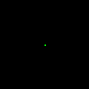

```rust
use embedded_graphics::{
    pixelcolor::Rgb888,
    prelude::*,
};

Pixel(Point::new(32, 32), Rgb888::GREEN).draw(&mut display)?;
```

## Draw a line

This example draws a red line with 8px stroke.

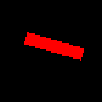

```rust
use embedded_graphics::{
    pixelcolor::Rgb888,
    prelude::*,
    primitives::Line,
    style::PrimitiveStyle,
};

Line::new(Point::new(16, 24), Point::new(51, 34))
    .into_styled(PrimitiveStyle::with_stroke(Rgb888::RED, 8))
    .draw(&mut display)?;
```

## Draw a rectangle

This example draws a rectangle with a 2px thick red stroke and cyan fill color.

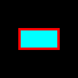

```rust
use embedded_graphics::{
    pixelcolor::Rgb888,
    prelude::*,
    primitives::Rectangle,
    style::PrimitiveStyleBuilder,
};

Rectangle::new(Point::new(16, 24), Size::new(32, 16))
    .into_styled(
        PrimitiveStyleBuilder::new()
            .stroke_width(2)
            .stroke_color(Rgb888::RED)
            .fill_color(Rgb888::CYAN)
            .build(),
    )
    .draw(&mut display)?;
```

## Draw a circle

This example draws a circle with no stroke and a solid blue fill.

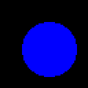

```rust
use embedded_graphics::{
    pixelcolor::Rgb888,
    prelude::*,
    primitives::Circle,
    style::PrimitiveStyle,
};

Circle::new(Point::new(16, 16), 40)
    .into_styled(PrimitiveStyle::with_fill(Rgb888::BLUE))
    .draw(&mut display)?;
```

## Draw an ellipse

This example draws an ellipse with a 2px green stroke.

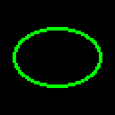

```rust
use embedded_graphics::{
    pixelcolor::Rgb888,
    prelude::*,
    primitives::Ellipse,
    style::PrimitiveStyle,
};

Ellipse::new(Point::new(8, 16), Size::new(48, 32))
    .into_styled(PrimitiveStyle::with_stroke(Rgb888::GREEN, 2))
    .draw(&mut display)?;
```

## Draw an arc

This example draws an arc with a 2px green stroke.

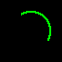

```rust
use embedded_graphics::{
    pixelcolor::Rgb888,
    prelude::*,
    primitives::Arc,
    style::PrimitiveStyle,
};

Arc::new(Point::new(12, 12), 40, -30.0.deg(), 150.0.deg())
    .into_styled(PrimitiveStyle::with_stroke(Rgb888::GREEN, 2))
    .draw(&mut display)?;
```

## Draw a sector

This example draws a sector with no stroke and a solid blue fill.

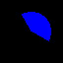

```rust
use embedded_graphics::{
    pixelcolor::Rgb888,
    prelude::*,
    primitives::Sector,
    style::PrimitiveStyle,
};

Sector::new(Point::new(12, 12), 40, -30.0.deg(), 150.0.deg())
    .into_styled(PrimitiveStyle::with_fill(Rgb888::BLUE))
    .draw(&mut display)?;
```

## Draw a triangle

This example draws a triangle with a solid 1px magenta stroke and no fill.

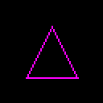

```rust
use embedded_graphics::{
    pixelcolor::Rgb888,
    prelude::*,
    primitives::Triangle,
    style::PrimitiveStyle,
};

Triangle::new(Point::new(32, 16), Point::new(16, 48), Point::new(48, 48))
    .into_styled(PrimitiveStyle::with_stroke(Rgb888::MAGENTA, 1))
    .draw(&mut display)?;
```

## Draw a polyline

This example draws a polyline with 1px cyan stroke.

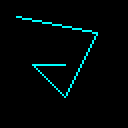

```rust
use embedded_graphics::{
    pixelcolor::Rgb888,
    prelude::*,
    primitives::Polyline,
    style::PrimitiveStyle,
};

let points: [Point; 5] = [
    Point::new(8, 8),
    Point::new(48, 16),
    Point::new(32, 48),
    Point::new(16, 32),
    Point::new(32, 32),
];

Polyline::new(&points)
    .into_styled(PrimitiveStyle::with_stroke(Rgb888::CYAN, 1))
    .draw(&mut display)?;
```

## Draw a rectangle with rounded corners

This example draws a rectangle with rounded corners, red stroke and green fill.

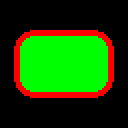

```rust
use embedded_graphics::{
    pixelcolor::Rgb888,
    prelude::*,
    primitives::{
        Rectangle,
        RoundedRectangle,
    },
    style::PrimitiveStyleBuilder,
};

let style = PrimitiveStyleBuilder::new()
    .stroke_color(Rgb888::RED)
    .stroke_width(3)
    .fill_color(Rgb888::GREEN)
    .build();

RoundedRectangle::with_equal_corners(
    Rectangle::new(Point::new(8, 16), Size::new(48, 32)),
    Size::new(10, 10),
)
.into_styled(style)
.draw(&mut display)?;
```

## Draw some text

This example draws the text "Hello,\nRust!" with the [`Font6x8`] font in green.

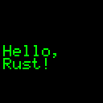

```rust
use embedded_graphics::{
    fonts::{
        Font6x8,
        Text,
    },
    pixelcolor::Rgb888,
    prelude::*,
    style::TextStyle,
};

Text::new("Hello,\nRust!", Point::new(2, 28))
    .into_styled(TextStyle::new(Font6x8, Rgb888::GREEN))
    .draw(&mut display)?;
```

## Display a TGA image

This example uses [tinytga](https://crates.io/crates/tinytga) to draw an image to the display.

The `graphics` feature of `tinytga` needs to be enabled in `Cargo.toml` to use the `Tga`
object with embedded-graphics.


```rust
use embedded_graphics::{
    image::Image,
    pixelcolor::Rgb888,
    prelude::*,
};
use tinytga::Tga;

let tga: Tga<Rgb888> = Tga::from_slice(include_bytes!(concat!(
    env!("CARGO_MANIFEST_DIR"),
    "/../simulator/examples/assets/rust-pride.tga"
)))
.unwrap();

let image = Image::new(&tga, Point::zero());

image.draw(&mut display)?;
```
